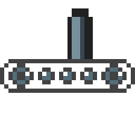

# solita [](https://github.com/metaplex-foundation/solita/actions/workflows/solita.yml)

**Sol** ana **I** DL **t** o **A** PI generator.



<!-- START doctoc generated TOC please keep comment here to allow auto update -->
<!-- DON'T EDIT THIS SECTION, INSTEAD RE-RUN doctoc TO UPDATE -->
**Table of Contents**  *generated with [DocToc](https://github.com/thlorenz/doctoc)*

- [How does it Work?](#how-does-it-work)
- [Shank + Solita Example (Recommended)](#shank--solita-example-recommended)
  - [Full Example: Token Metadata Solita + Shank Setup](#full-example-token-metadata-solita--shank-setup)
- [Anchor + Solita Example (Recommended)](#anchor--solita-example-recommended)
  - [Full Example: MPL Candy Machine Solita + Anchor Setup](#full-example-mpl-candy-machine-solita--anchor-setup)
- [Type Aliases](#type-aliases)
- [Custom De/Serializers](#custom-deserializers)
- [Advanced Shank + Solita Example](#advanced-shank--solita-example)
- [Advanced Anchor + Solita Example](#advanced-anchor--solita-example)
- [Solita in the Wild](#solita-in-the-wild)
- [LICENSE](#license)

<!-- END doctoc generated TOC please keep comment here to allow auto update -->

## How does it Work?

_Solita_ generates a low level TypeScript SDK for your _Solana_ Rust programs from the [IDL](https://en.wikipedia.org/wiki/Interface_description_language) extracted by
[anchor](https://github.com/project-serum/anchor) or
[shank](https://github.com/metaplex-foundation/shank).

## Shank + Solita Example (Recommended)

In order to use _solita_ with shank do the following:

- add the `shank` library to your Rust project via `cargo add shank`
- annotate your Rust program as outlined [here](https://docs.rs/crate/shank_macro/latest)
- add `solita` to the dev dependencies of your SDK package via `yarn add -D @metaplex-foundation/solita`
- add a config similar to the below into `.solitarc.js` in your SDK package root

```js
const path = require('path');
const programDir = path.join(__dirname, '..', 'program');
const idlDir = path.join(__dirname, 'idl');
const sdkDir = path.join(__dirname, 'src', 'generated');
const binaryInstallDir = path.join(__dirname, '.crates');

module.exports = {
  idlGenerator: 'shank',
  programName: 'mpl_token_vault',
  idlDir,
  sdkDir,
  binaryInstallDir,
  programDir,
};
```

Now running `yarn solita` from the same folder will take care of installing the matching
_shank_ binary and generating the IDL and SDK.

Run it each time you make a change to your program to generate the TypeScript SDK.

Since we're writing the _shank_ binary to `.crates/` you should add that folder to your
`.gitignore`.

### Full Example: Token Metadata Solita + Shank Setup

- [annotated instructions](https://github.com/metaplex-foundation/metaplex-program-library/blob/5f0c0656ff250f7a70643c06306962186f37ef5d/token-metadata/program/src/instruction.rs#L80)
- [annotated accounts](https://github.com/metaplex-foundation/metaplex-program-library/blob/master/token-metadata/program/src/state.rs#L194)
- [generated TypeScript](https://github.com/metaplex-foundation/metaplex-program-library/tree/master/token-metadata/js/src/generated)

## Anchor + Solita Example (Recommended)

In order to use _solita_ with anchor do the following:

- annotate your Rust program with anchor attributes 
- add `solita` to the dev dependencies of your SDK package via `yarn add -D @metaplex-foundation/solita`
- add a config similar to the below into `.solitarc.js` in your SDK package root

```js
const path = require('path');
const programDir = path.join(__dirname, '..', 'program');
const idlDir = path.join(__dirname, 'idl');
const sdkDir = path.join(__dirname, 'src', 'generated');
const binaryInstallDir = path.join(__dirname, '.crates');

module.exports = {
  idlGenerator: 'anchor',
  programName: 'auction_house',
  programId: 'hausS13jsjafwWwGqZTUQRmWyvyxn9EQpqMwV1PBBmk',
  idlDir,
  sdkDir,
  binaryInstallDir,
  programDir,
};
```

Now running `yarn solita` from the same folder will take care of installing the matching
_anchor_ binary and generating the IDL and SDK.

Run it each time you make a change to your program to generate the TypeScript SDK.

Since we're writing the _anchor_ binary to `.crates/` you should add that folder to your
`.gitignore`.

### Full Example: MPL Candy Machine Solita + Anchor Setup
  
- [annotated anchor program](https://github.com/metaplex-foundation/metaplex-program-library/blob/5f0c0656ff250f7a70643c06306962186f37ef5d/candy-machine/program/src/lib.rs) 
- [generated TypeScript](https://github.com/metaplex-foundation/metaplex-program-library/tree/master/candy-machine/js/src/generated)

## Type Aliases

In order to have Solita resolve specific types to a Rust builtin type please provide a
type alias map as in the below config. Solita then will treat those as if they were the aliased
type.

```js
module.exports = {
  idlGenerator: 'anchor',
  [ .. ]
  typeAliases: {
    UnixTimestamp: 'i64'
  }
};
```

## Custom De/Serializers

For some accounts the generated de/serializers don't work. In those cases a custom
de/serializer can be specified.

This is as simple as adding a module to your project which exports a either or both of the
below functions:

```ts
export function deserialize(buf: Buffer, offset = 0): [<Account>, number] {
  [..]
}

export function serialize(instance: <Account>Args, byteSize?: number): [Buffer, number]
  [..]
}
```

Then provide them as `serializers` to `Solita` or via the solita config:

```js
module.exports = {
  idlGenerator: 'shank',
  [ .. ]
  serializers: {
    Metadata: './src/custom/metadata-deserializer.ts',
  },
};
```

## Advanced Shank + Solita Example

If you need more control you can also add a script. However you're on your own to ensure that
the globally installed _shank_ binary matches the version of its library you're using.

- globally install `shank` via `cargo install shank-cli`
- add a script similar to the below to your SDK package and 
 
```js
const path = require('path');
const { Solita } = require('@metaplex-foundation/solita');
const {
  rustbinMatch,
  confirmAutoMessageConsole,
} = require('@metaplex-foundation/rustbin')
const { spawn } = require('child_process');

const programDir = path.join(__dirname, '..', '..', 'program');
const cargoToml = path.join(programDir, 'Cargo.toml')
const generatedIdlDir = path.join(__dirname, '..', 'idl');
const generatedSDKDir = path.join(__dirname, '..', 'src', 'generated');
const rootDir = path.join(__dirname, '..', '.crates')

const PROGRAM_NAME = 'mpl_token_metadata';
const rustbinConfig = {
  rootDir,
  binaryName: 'shank',
  binaryCrateName: 'shank-cli',
  libName: 'shank',
  dryRun: false,
  cargoToml,
}

async function main() {
  const { fullPathToBinary: shankExecutable } = await rustbinMatch(
    rustbinConfig,
    confirmAutoMessageConsole
  )
  const shank = spawn(shankExecutable, ['idl', '--out-dir', generatedIdlDir, '--crate-root', programDir])
    .on('error', (err) => {
      console.error(err);
      if (err.code === 'ENOENT') {
        console.error(
          'Ensure that `shank` is installed and in your path, see:\n  https://github.com/metaplex-foundation/shank\n',
        );
      }
      process.exit(1);
    })
    .on('exit', () => {
      generateTypeScriptSDK();
    });

  shank.stdout.on('data', (buf) => console.log(buf.toString('utf8')));
  shank.stderr.on('data', (buf) => console.error(buf.toString('utf8')));
}

async function generateTypeScriptSDK() {
  console.error('Generating TypeScript SDK to %s', generatedSDKDir);
  const generatedIdlPath = path.join(generatedIdlDir, `${PROGRAM_NAME}.json`);

  const idl = require(generatedIdlPath);
  const gen = new Solita(idl, { formatCode: true });
  await gen.renderAndWriteTo(generatedSDKDir);

  console.error('Success!');

  process.exit(0);
}

main().catch((err) => {
  console.error(err)
  process.exit(1)
})
```

## Advanced Anchor + Solita Example

If you need more control you can also add a script. However you're on your own to ensure that
the globally installed _anchor_ binary matches the version of its library you're using.

- globally [install anchor](https://book.anchor-lang.com/chapter_2/installation.html)
- add a script similar to the below to your SDK package

```js
const path = require('path');
const {
  rustbinMatch,
  confirmAutoMessageConsole,
} = require('@metaplex-foundation/rustbin')
const { spawn } = require('child_process');
const { Solita } = require('@metaplex-foundation/solita');
const { writeFile } = require('fs/promises');

const PROGRAM_NAME = 'candy_machine';
const PROGRAM_ID = 'cndy3Z4yapfJBmL3ShUp5exZKqR3z33thTzeNMm2gRZ';

const programDir = path.join(__dirname, '..', '..', 'program');
const cargoToml = path.join(programDir, 'Cargo.toml')
const generatedIdlDir = path.join(__dirname, '..', 'idl');
const generatedSDKDir = path.join(__dirname, '..', 'src', 'generated');
const rootDir = path.join(__dirname, '..', '.crates')

async function main() {
  const { fullPathToBinary: anchorExecutable } = await rustbinMatch(
    rustbinConfig,
    confirmAutoMessageConsole
  )
  const anchor = spawn(anchorExecutable, ['build', '--idl', generatedIdlDir], { cwd: programDir })
    .on('error', (err) => {
      console.error(err);
      // @ts-ignore this err does have a code
      if (err.code === 'ENOENT') {
        console.error(
          'Ensure that `anchor` is installed and in your path, see:\n  https://project-serum.github.io/anchor/getting-started/installation.html#install-anchor\n',
        );
      }
      process.exit(1);
    })
    .on('exit', () => {
      console.log('IDL written to: %s', path.join(generatedIdlDir, `${PROGRAM_NAME}.json`));
      generateTypeScriptSDK();
    });

  anchor.stdout.on('data', (buf) => console.log(buf.toString('utf8')));
  anchor.stderr.on('data', (buf) => console.error(buf.toString('utf8')));
}

async function generateTypeScriptSDK() {
  console.error('Generating TypeScript SDK to %s', generatedSDKDir);
  const generatedIdlPath = path.join(generatedIdlDir, `${PROGRAM_NAME}.json`);

  const idl = require(generatedIdlPath);
  if (idl.metadata?.address == null) {
    idl.metadata = { ...idl.metadata, address: PROGRAM_ID };
    await writeFile(generatedIdlPath, JSON.stringify(idl, null, 2));
  }
  const gen = new Solita(idl, { formatCode: true });
  await gen.renderAndWriteTo(generatedSDKDir);

  console.error('Success!');

  process.exit(0);
}

main().catch((err) => {
  console.error(err)
  process.exit(1)
})
```

## Solita in the Wild

Find more _solita_, _shank_ and _anchor_  examples inside the [metaplex-program-library](https://github.com/metaplex-foundation/metaplex-program-library).

## LICENSE

Apache-2.0
